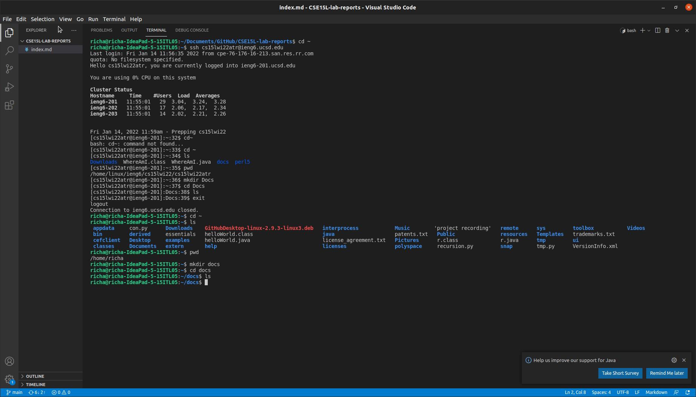

# Lab Report 1 - Week 2

## Installing VScode:
> Go to the [VScode website](https://code.visualstudio.com/) and download VScode. Then install it following your operating system's instructions. Once installed and opened, you should see this: 

## Remotely Connecting:
> First download and install [OpenSSH](https://docs.microsoft.com/en-us/windows-server/administration/openssh/openssh_install_firstuse) and find your [CSE15L account](https://sdacs.ucsd.edu/~icc/index.php). Then open a new terminal in the home directory in VSCode and type the comand: ssh username@ieng6.ucsd.edu, replacing username with your 15L username. After pressing enter, you should be asked for your password or be asked a yes or know question, which you should answer yes to, and then be connected to the remote computer.
  It should like this when you have connected

## Trying Some Commands:

> On the remote computer, run comands like cd ~, ls, pwd, mkdir docs, and cd docs to see different commands executed. Then run the command "exit" to go back to your computer. Try runnign the same commands on your computer's terminal. 

## Moving Fliles with scp:
> Run the scp command: scp filename username@ieng6.ucsd.edu:~/(replace username and filename with yours) in the terminal of the directory inwhich the file is in. To check whether it coppied to the remote computer, connect to the remote computer and run the command ls. You should see the file in the home directory of the remote computer. 
 

## Setting an SSH Key:
> On your computer, run the command ssh-keyben to create the public and private files and put in the suggested file path where it asks you to enter a file. Then enter in a passphrase(any short passcode) and reenter it. Then to check it, try the scp or ssh command and you should be asked to enter the short passcode the first time, but you shouldn't be aksed to inter your full account password. 

## Optimizing Remote Running:
> Personally, I find that the fastest way to run commands remotely is to use quotation marks after my ssh command and enter the comands you want to run remotely inside of then, separated by semicolons. Also, use the up and down arrows to use the same commands you used before so you don't have to retype the same commands. 

