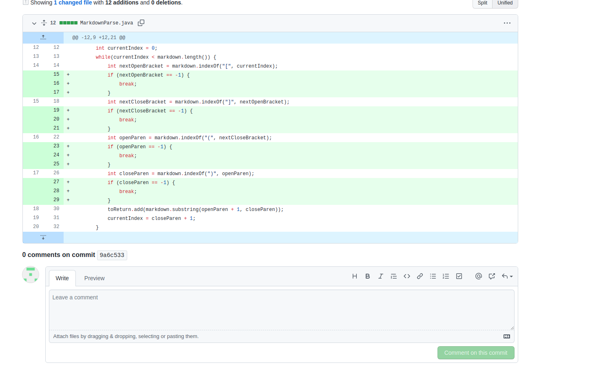
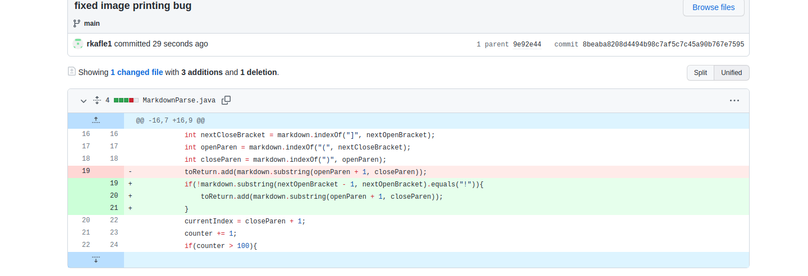
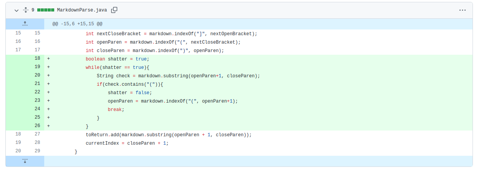

# Lab Report 2 - Week 4
## Code Change 1:
 <br>
[failiure-inducing input file](incorrectinputfile.md)
> Incorrect Output: ```[((((, link.com]```<br>
> The bug is that the ```getLinks()``` method works incorrectly when open and closed brackets and parenthesis are used in the input file with text other than links. Because of this, the bug's symptom is that other text in the file, besides the links, are also added to the returned list in the method. The failiure-inducing input causes this because before the links are written, there is a squence of these open and closed brackets and parentheseis without links within the parentheses so somthing besides only the link was added to the list. 

## Code Change 2:
 <br>
[failiure-inducing input file](incorrectinputfile2.md)
> Incorrect Output: ```[image.jpg, smth.com]```<br>
> The bug is that the ```getLinks()``` method doesn't recognize that an image is not a link so a symptom of the bug is that images are also added to the returned list of the method. The failiure-inducing input is a file that has both an image and a link so due to the bug, the method returns a list with both the image and link in it. 

## Code Change 3: 
 <br>
[failiure-inducing input file](incorrectinputfile3.md)
> Incorrect Output: (infinite loop) [link.com, k!](https://something.com, link.com, k!](https://something.com, link.com, k!](https://something.com, link.com, k!](https://something.com, link.com, k!](https://something.com, link.com, k!](https://something.com, link.com, k!](https://something.com, link.com, k!](https://something.com, link.com, k!](https://something.com, link.com, k!](https://something.com, link.com, k!](https://something.com, link.com, k!](https://something.com, link.com, k!](https://something.com, link.com, k!](https://something.com, link.com, k!](https://something.com, link.com, k!](https://something.com, link.com, k!](https://something.com, link.com, k!](https://something.com, link.com, k!](https://something.com, link.com, k!](https://something.com, link.com, k!](https://something.com, link.com, k!]...]<br>
> The bug is that the loop in the ```getLinks()``` doesn't stop if there are unclosed sets of parentheses. Because of this, files such as the failiure-inducing input file, which has an open parenthesis without a closing one, causes the loop to go on infinitly until there is no more space. 

