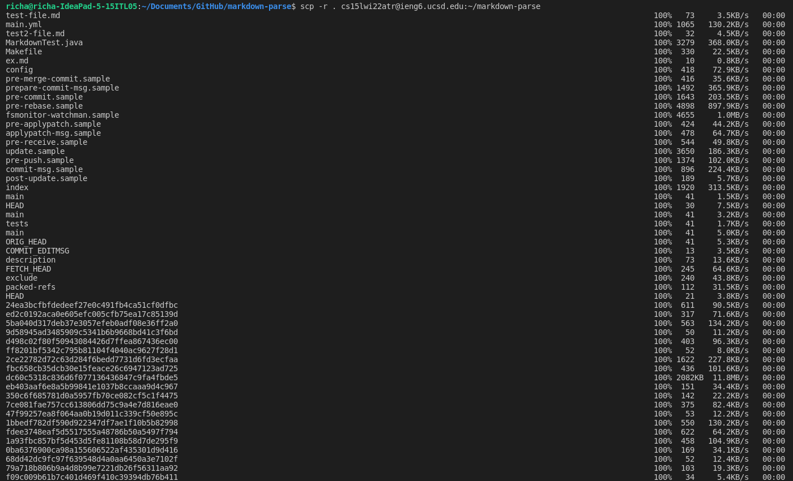
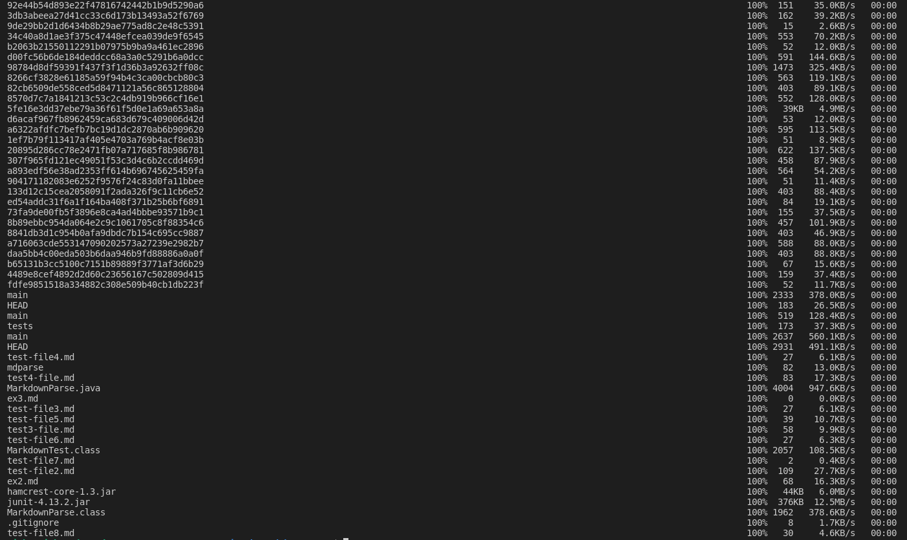
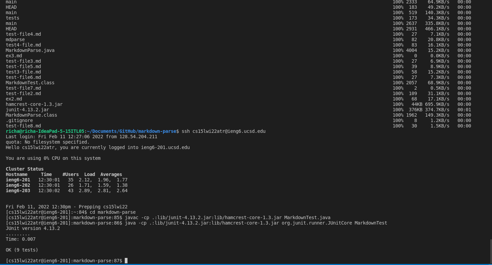
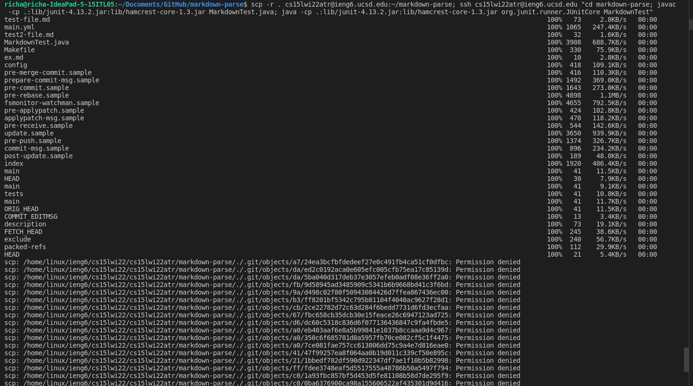
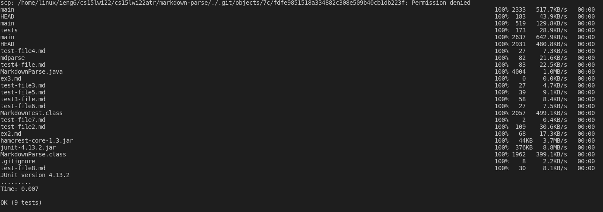

# Lab Report 3 - Week 6
## Copy whole directories with ```scp -r```



> I used the ```scp``` command that I used when copying an individual file to my ieng6 account, but instead I wrote it like ```scp -r . <username>@ieng6.ucsd.edu:~/markdown-parse``` which allowed me to copy the whole directory instead of just one file. This command makes ```scp``` copy recursively through the ```-r``` and the ```.``` indicates the source which is the directory I was in: markdown-parse.

<br>


> I logged into my ieng6 account using the command ```ssh <username>@ieng6.ucsd.edu``` and went to the markdown-parse directory using the command ```cd markdown-parse```. Then I ran the ```javac``` and ```java``` commands to run the tests, which all passed. 

<br>



> In order to make running the tests quicker on the remote server, I combined the commands into one: ```scp -r . <username>@ieng6.ucsd.edu:~/markdown-parse; ssh <username>@ieng6.ucsd.edu "cd markdown-parse; javac -cp .:lib/junit-4.13.2.jar:lib/hamcrest-core-1.3.jar MarkdownTest.java; java -cp .:lib/junit-4.13.2.jar:lib/hamcrest-core-1.3.jar org.junit.runner.JUnitCore MarkdownTest"```. This command allows me to copy the whole markdown-parse directory to my ieng6 account, log into the remote server, change into the markdown-parse directory, and run my tests. When I have the command already coppied, it takes 3 keystrokes to do all of these things. 


