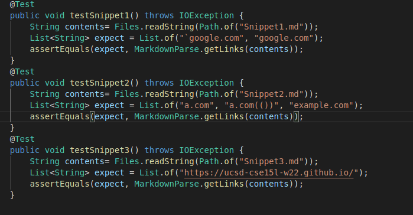

# Lab Report 4 - Week 8
## Links to both repositories:
[My Repository](https://github.com/rkafle1/markdown-parse)<br>
[Reviewed Repository](https://github.com/5ean-github/markdown-parse)
## Tests: 
### Finding expected links:


### Test Code:

### My output: 
> none of the 3 tests passed. 

### Reviewed output:
> none of the 3 tests passed.

## Questions:
### 1.
> Yes, I think it is possible to fix with less than 10 lines of code. I would add some if statements to check if it is an inline code break the while loop if so. I would check this before finding the next ```[``` or ```(```.
### 2.
> No, I think I would need to include multiple if statements that would break the while loop. I would need to check that each open bracket and parenthesis had a coorespondiing closed one and include any nested or escaped brackets/parenthesis in the link if there is an outer open and closed parenthesis.
### 3.
> It may take less than 10 lines if I were to add a block of code in the begining that checked and deleted any new lines in the file. This could be done through a for loop and an if statement. 


